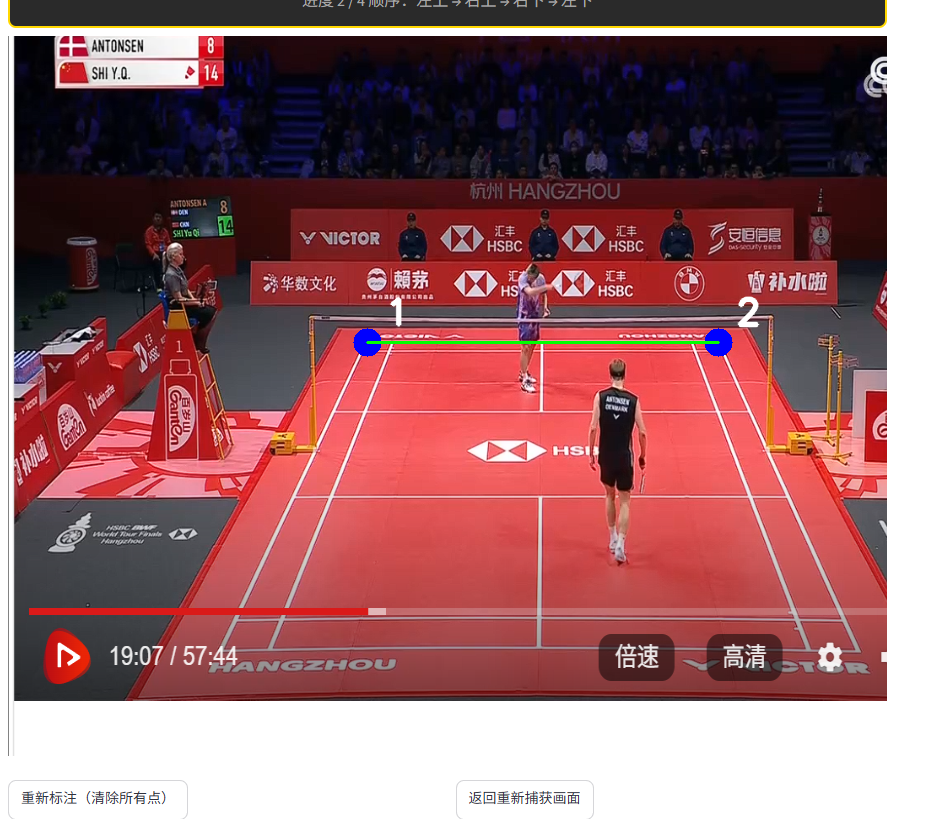
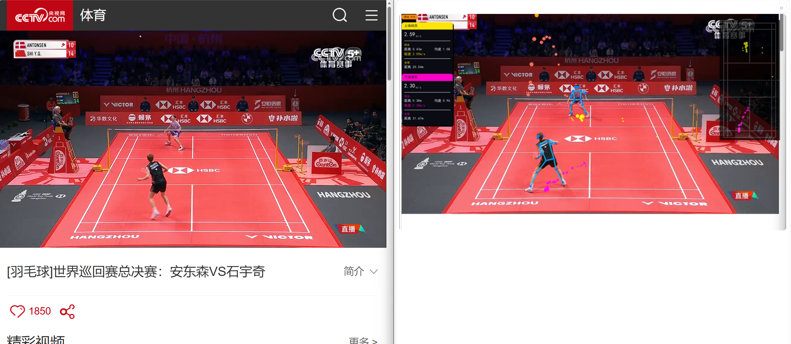
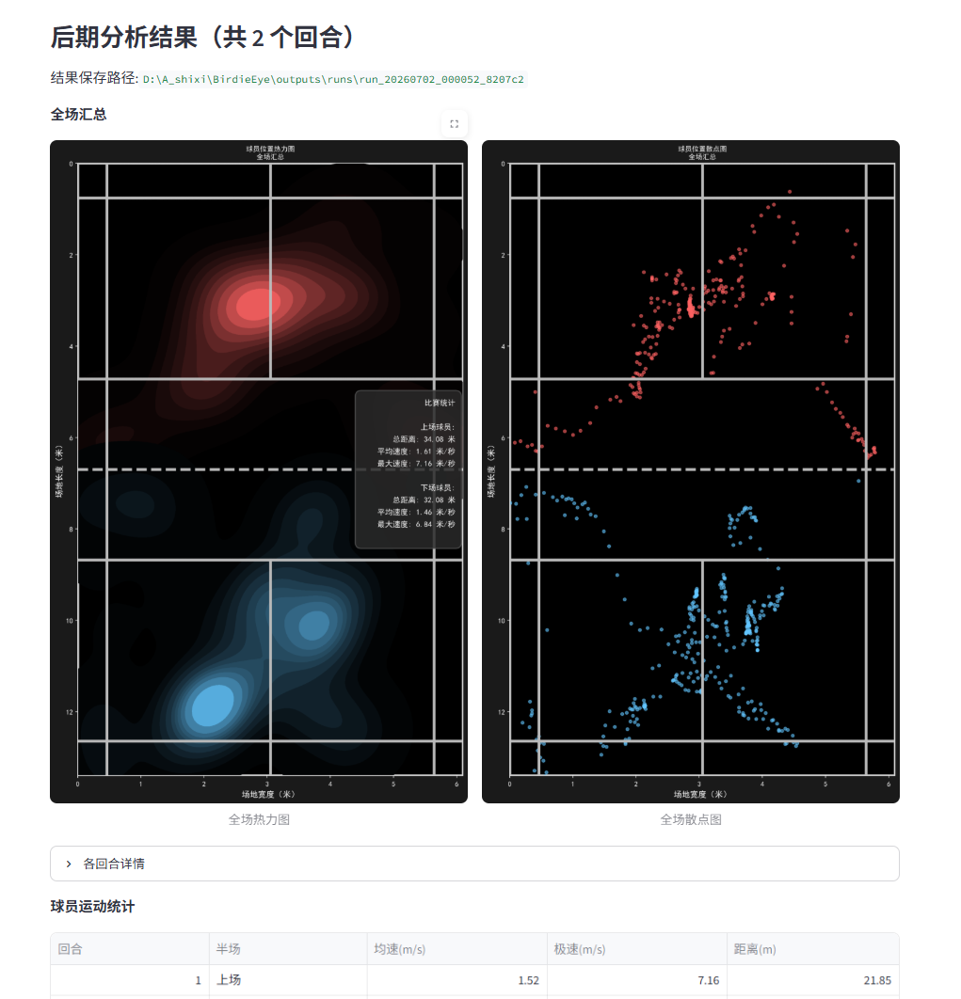

# BirdieEye: AI Badminton Hawk-Eye System 🏸

<div align="center">

[](https://github.com/yo-WASSUP/BirdieEye/stargazers)
[](https://github.com/yo-WASSUP/BirdieEye/network/members)
[](https://github.com/yo-WASSUP/BirdieEye/blob/main/LICENSE)
[](https://www.xiaohongshu.com/explore/6a37b1d20000000011016229?xsec_token=ABod3wXBTiDppp6W2Ou0QHlu2eotUkeu27-ha64nFRR74=&xsec_source=pc_user)

**A computer-vision toolkit for badminton match video analysis**

[中文](README.md) | [English](README_EN.md)

</div>

## 🎬 Preview

| Feature | Screenshot |
|---------|-----------|
| **Screen Capture** — capture any screen region for real-time analysis |  |
| **Court Annotation** — mark 4 court corners for coordinate mapping |  |
| **Live Analysis** — skeleton, trajectory tracking, stats overlay |  |
| **Post-analysis** — per-rally heatmap, scatter plot, movement stats |  |

## 🆕 Changelog

**2026-07-02**: Official open-source release.
---

## ✨ Features

- **Player pose detection** - Supports RTMPose, RTMO, and Ultralytics YOLO Pose for human keypoint and skeleton detection.
- **Shuttlecock detection** - Uses a YOLO model to detect shuttlecock positions and draw trajectories in the output video.
- **Court coordinate mapping** - Manually annotates court keypoints and maps image coordinates to standard badminton court coordinates.
- **Player position tracking** - Tracks upper-court and lower-court players separately and records movement trajectories.
- **Rally detection** - Detects rally start/end states from continuous court-view matching and records rally IDs in overlays and detection data.
- **Motion statistics** - Computes movement distance, current speed, maximum speed, and rally counts.
- **Visual output** - Generates annotated videos with skeletons, trajectories, statistics, and court trajectory overlays.
- **Position charts** - Automatically generates player position heatmaps and scatter plots.
- **Chinese / English display** - Switch visualization text with `--language zh/en`.
- **Local execution** - Videos, models, and analysis outputs stay on your local machine.
- **Multi-source real-time input** - Supports local video, screen capture (mss), and headless browser (Chrome DevTools Protocol) for analyzing live feeds.
- **Court drift correction** - Periodically re-detects court corners via homography to correct camera drift during long sessions, maintaining coordinate mapping accuracy.
- **Real-time heatmap** - 2-minute sliding-window heatmap with separate upper/lower court halves, overlaid as a minimap in the bottom-right corner.
- **Post-analysis** - Automatic rally segmentation, KDE heatmaps, scatter plots, and per-rally movement statistics for publication-quality analysis.
- **GPU inference optimization** - FP16 half-precision inference + TF32 matrix multiplication + cuDNN benchmark for significantly improved GPU frame rates.
- **Web console** - Streamlit interface with real-time frame display, parameter tuning, court annotation, history browsing, and one-click `start.bat` launch.
- **SQLite history** - Each run automatically records metrics to a SQLite database for historical review and comparison.

## Requirements

- Python 3.8+
- Font: Chinese text rendering requires a bold font file (e.g., `simhei.ttf`). Download it from [GitHub Releases](https://github.com/yo-WASSUP/BirdieEye/releases/latest) and place in the project root.
- FFmpeg available in system `PATH`
- Shuttlecock YOLO detection weight, downloaded from [GitHub Releases](https://github.com/yo-WASSUP/BirdieEye/releases/latest)

## Performance Requirements and Reference Speed

Recommended setup:

- GPU with 6GB+ VRAM. More VRAM helps with higher-resolution videos and larger pose models.
- 16GB+ system RAM.
- SSD storage for output videos, `detections.jsonl`, and visualization images.
- CPU execution is supported, but pose detection and shuttlecock detection will be much slower. It is best suited for short clips or feature checks.

Actual speed depends on the GPU, video resolution, pose model, preview display, and audio export settings.

For a 720p video with `--pose-family yolo-pose --yolo-pose-model yolo11n-pose.pt` and `weights/yolo11s-ball.pt`, GPU timing logs are typically close to:

```text
pose 0.02s, shuttlecock 0.02s, shuttle draw 0.00s, players draw 0.01s, court draw 0.00s
```

Use `--performance-stats` to print a compact timing summary about every 5 seconds and identify whether the bottleneck is pose inference, shuttlecock detection, or drawing.

Install dependencies:
```bash
pip install -r requirements.txt     # CPU version (default)
# GPU: manually switch to CUDA torch + onnxruntime-gpu
```

Download model weights from [Releases](https://github.com/oveerou/BirdieEye/releases) to `weights/`.

## 🚀 Quick Start

**Local video analysis (CLI):**
```bash
python main.py --video-path demo.mp4
# First run: annotate 4 court corners in popup window; subsequent runs reuse cache
```

**Real-time screen capture:**
```bash
python -m badminton_analysis.live --source screen_capture --region 0,0,1920,1080
```

**Web UI (recommended):**
```bash
start.bat        # one-click launcher
# or: python -m streamlit run app.py
# open http://localhost:8501
```

Three input sources: upload video, screen capture, headless browser.

## 📊 Features

| Feature | Description |
|---------|-------------|
| Pose Detection | YOLO-Pose / RTMPose / RTMO, COCO 17 keypoints |
| Ball Detection | YOLO model + trajectory tracking + outlier filter |
| Court Calibration | Auto HSV / Hough line detection or manual 4-corner annotation |
| Player Tracking | Upper/lower court split, dual coordinates (image + court) |
| Rally Detection | Template-matching rolling window (5 consecutive frames) |
| Motion Stats | Speed, distance, per-rally & match-wide aggregation |
| Real-time Overlay | Skeletons, trajectories, stats panel, minimap, 2min heatmap |
| Post-analysis | Rally segmentation, KDE heatmaps, scatter plots, movement stats |
| Drift Correction | Homography-based periodic re-detection for camera motion |
| GPU Optimization | FP16 inference, TF32 matmul, cuDNN benchmark |
| Data Export | JSONL per-frame records + SQLite history + metrics.json |

## 📁 Outputs

```
outputs/<video_name>/
├── detect_*.mp4           # annotated video
├── detections.jsonl       # per-frame detection data
├── metadata.json          # run metadata
├── court_annotations.txt  # cached court corners
└── heatmaps + scatter_plots/
```

## 📄 License

Apache License 2.0

